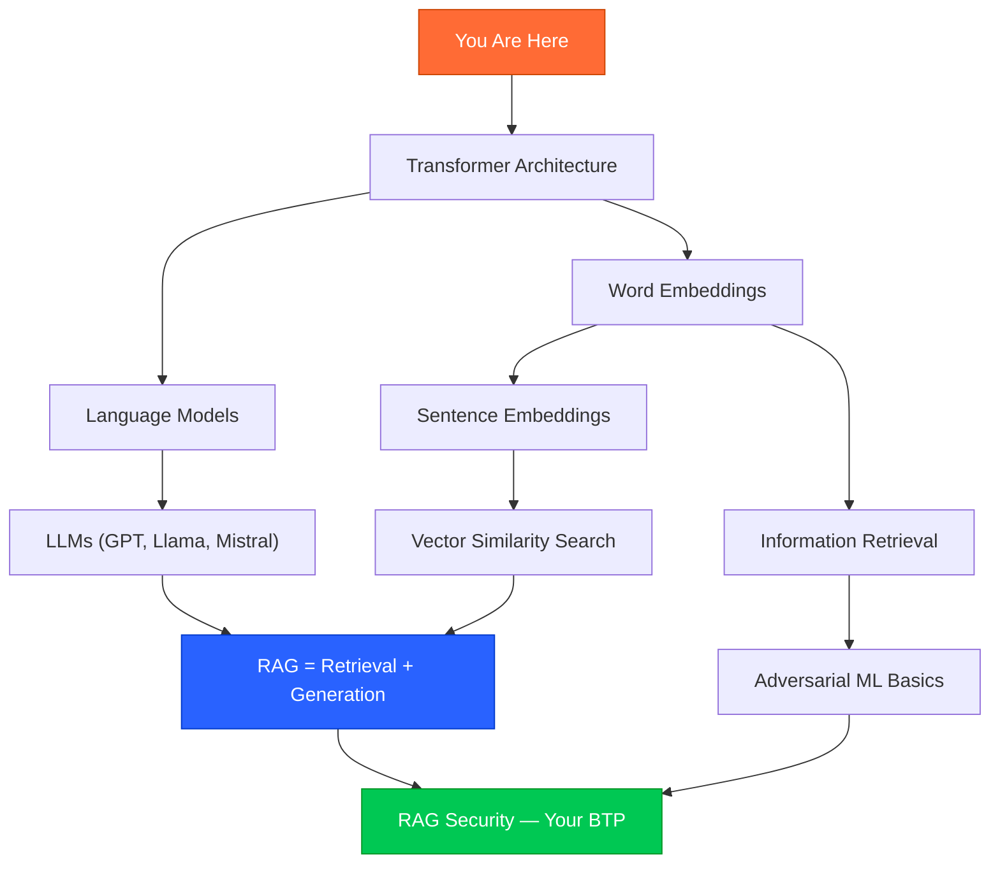

# Beginner's Learning Roadmap: RAG Security Research
## From Zero to Research-Ready

> This document is designed for someone who is new to RAG, LLMs, and adversarial ML. Follow it in order — each phase builds on the previous one.

---

## Phase 0: Prerequisites — What You Need to Understand First

Before touching any papers, make sure you're comfortable with these concepts. If any are unfamiliar, start here.

### Concept Map



### Essential Background Concepts

| Concept | What It Is | Why You Need It | Learn From |
|---------|-----------|-----------------|------------|
| **Transformer architecture** | The neural network architecture behind all modern LLMs | Understanding how LLMs process text and context | "Attention Is All You Need" (Vaswani et al., 2017) — but watch Jay Alammar's blog post first |
| **Word/Sentence Embeddings** | Converting text into numeric vectors that capture meaning | This is what makes RAG retrieval work | Sentence-BERT paper (Reimers & Gurevych, 2019) |
| **Cosine Similarity** | Measuring how "similar" two vectors are (range -1 to 1) | Core of how RAG retrieves documents | Any linear algebra resource |
| **Vector Databases** | Databases optimized for storing and searching embeddings | FAISS and ChromaDB — your project's core infrastructure | Pinecone/Weaviate tutorials |
| **Information Retrieval** | The field of finding relevant documents for a query | BM25, TF-IDF, dense retrieval — foundation of RAG | Stanford IR textbook (free online) |
| **Retrieval-Augmented Generation** | LLM + retrieved documents = more accurate answers | **This is your project's subject** | Lewis et al. (2020), "Retrieval-Augmented Generation for Knowledge-Intensive NLP Tasks" |
| **Adversarial Machine Learning** | Deliberately crafting inputs to fool ML models | The attack side of your BTP | Goodfellow et al. (2014), "Explaining and Harnessing Adversarial Examples" |
| **Threat Modeling** | Formally defining what an attacker can do (capabilities, goals, knowledge) | Structuring your attack scenarios | STRIDE model, OWASP LLM Top 10 |

---

## Phase 1: Foundational Reading

> **Goal:** Understand what RAG is, how it works, and why it's important.

### 1.1 — What Are LLMs and How Do They Work?

| # | Resource | Type | Time | Notes |
|---|----------|------|------|-------|
| 1 | **Jay Alammar — "The Illustrated Transformer"** | Blog post | 1 hour | The single best visual explanation of transformers. Start here. |
| | URL: https://jalammar.github.io/illustrated-transformer/ | | | |
| 2 | **Jay Alammar — "The Illustrated GPT-2"** | Blog post | 45 min | How autoregressive language models generate text |
| | URL: https://jalammar.github.io/illustrated-gpt2/ | | | |
| 3 | **3Blue1Brown — "But what is a GPT?"** (YouTube) | Video | 30 min | Beautiful visual intuition for transformers |
| | URL: https://www.youtube.com/watch?v=wjZofJX0v4M | | | |

### 1.2 — What Are Embeddings?

| # | Resource | Type | Time | Notes |
|---|----------|------|------|-------|
| 4 | **Jay Alammar — "The Illustrated Word2Vec"** | Blog post | 1 hour | Start with word embeddings before moving to sentence embeddings |
| | URL: https://jalammar.github.io/illustrated-word2vec/ | | | |
| 5 | **Sentence-BERT paper** (Reimers & Gurevych, 2019) | Paper | 2 hours | How sentence embeddings are created. Read sections 1-3 only. |
| | URL: https://arxiv.org/abs/1908.10084 | | | |
| 6 | **HuggingFace — Sentence Transformers documentation** | Docs | 1 hour | Hands-on: install and use embedding models |
| | URL: https://www.sbert.net/ | | | |

### 1.3 — What is RAG?

| # | Resource | Type | Time | Notes |
|---|----------|------|------|-------|
| 7 | **Lewis et al. — "Retrieval-Augmented Generation for Knowledge-Intensive NLP Tasks"** (2020) | Paper | 3 hours | **The original RAG paper.** Read the full paper. |
| | URL: https://arxiv.org/abs/2005.11401 | | | |
| 8 | **LangChain RAG Tutorial** | Tutorial | 2 hours | Build your first RAG system end-to-end |
| | URL: https://python.langchain.com/docs/tutorials/rag/ | | | |
| 9 | **LlamaIndex "Build a RAG from Scratch"** | Tutorial | 2 hours | Alternative framework; good to compare approaches |
| | URL: https://docs.llamaindex.ai/en/stable/understanding/ | | | |

### 1.4 — Hands-On: Build a Basic RAG System

Before reading any attack papers, **build a working RAG system yourself.** This is non-negotiable. You can't defend what you don't understand.

```python
# Minimal RAG pipeline — build this after Phase 1 reading
# Tools: Python, sentence-transformers, chromadb, transformers

# 1. Install dependencies
# pip install sentence-transformers chromadb transformers langchain

# 2. Load documents → chunk → embed → store in ChromaDB
# 3. Accept a user query → embed → retrieve top-k → generate answer
# 4. Evaluate: Does the system answer correctly?

# Once this works: try manually inserting a wrong document and see 
# if the system's answer changes. That's your first "poisoning attack."
```

---

## Phase 2: Core Attack Papers

> **Goal:** Understand exactly how RAG systems are attacked.

### Priority 1 — Read These First

| # | Paper | Why Read It | Difficulty | Reading Tips |
|---|-------|-------------|-----------|-------------|
| 10 | **"Not What You Signed Up For: Compromising LLM-Integrated Applications with Indirect Prompt Injection"** (Greshake et al., 2023) | Foundational paper for the entire field. Defines indirect prompt injection. | ⭐⭐ Medium | Focus on Section 3 (attack scenarios) and Section 5 (RAG implications) |
| | URL: https://arxiv.org/abs/2302.12173 | | | |
| 11 | **"PoisonedRAG: Knowledge Corruption Attacks to Retrieval-Augmented Generation"** (Zou et al., USENIX Security 2025) | **The single most important paper for your BTP.** Defines the attack you'll defend against. | ⭐⭐⭐ Hard | Read Sections 1-4 carefully. Section 3 (threat model + formulation) is critical. Study their GitHub code. |
| | URL: https://arxiv.org/abs/2402.07867 | | | |
| | Code: https://github.com/sleeepeer/PoisonedRAG | | | |
| 12 | **"Machine Against the RAG: Jamming with Blocker Documents"** (Shafran et al., USENIX Security 2025) | Second attack class (DoS). Good for showing breadth in your threat model. | ⭐⭐ Medium | Focus on the attack mechanism (Section 3) and the black-box generation method |
| | URL: https://arxiv.org/abs/2406.05870 | | | |

### Priority 2 — Deeper Attack Understanding

| # | Paper | Why Read It | Difficulty |
|---|-------|-------------|-----------|
| 13 | **"Poisoning Retrieval Corpora by Injecting Adversarial Passages"** (Zhong et al., EMNLP 2023) | The original gradient-based corpus poisoning attack. Predates PoisonedRAG. | ⭐⭐⭐ Hard |
| | URL: https://arxiv.org/abs/2310.19156 | | |
| 14 | **"Hidden-in-Plain-Text: Indirect Prompt Injection in the Wild"** (2024) | Stealthy IPI techniques using Unicode tricks and formatting | ⭐⭐ Medium |
| | URL: https://arxiv.org/abs/2406.05948 | | |
| 15 | **"Overcoming the Retrieval Barrier: Indirect Prompt Injection in the Wild"** (2024) | Real-world IPI attacks via emails and web documents | ⭐⭐ Medium |
| | URL: https://arxiv.org/abs/2502.14059 | | |

---

## Phase 3: Defense Papers

> **Goal:** Understand existing defenses and identify what's missing.

### Must-Read Defenses

| # | Paper | What It Proposes | Difficulty | Reading Tips |
|---|-------|-----------------|-----------|-------------|
| 16 | **"RAGuard: A Layered Defense Framework"** (NeurIPS 2025) | Adversarial retriever training + Zero-Knowledge Inference Patch | ⭐⭐⭐ Hard | Focus on the ZKIP mechanism — this is the most novel contribution |
| | URL: https://arxiv.org/abs/2501.15438 | | | |
| 17 | **"RevPRAG"** (ACL 2025) | Detection via LLM activation patterns; 98% TPR | ⭐⭐⭐ Hard | Focus on how they extract and classify activation patterns |
| | URL: https://arxiv.org/abs/2411.18203 | | | |
| 18 | **"ReliabilityRAG"** (2025-2026) | Contradiction graph + MIS for document selection | ⭐⭐⭐ Hard | The graph-theoretic approach is elegant; understand the MIS formulation |
| | URL: https://arxiv.org/abs/2504.15801 | | | |

### Benchmarks and Evaluation

| # | Paper | What It Provides | Difficulty |
|---|-------|-----------------|-----------|
| 19 | **"SafeRAG: A Benchmark for Safety Evaluation of RAG"** (ACL 2025) | Categorized attack taxonomy and evaluation framework | ⭐⭐ Medium |
| | URL: https://aclanthology.org/2025.acl-long.290/ | | |
| 20 | **"Benchmarking Poisoning Attacks against RAG"** (RAG Security Bench, 2025) | Comparison of 13 attacks and 7 defenses | ⭐⭐ Medium |
| | URL: https://arxiv.org/abs/2506.05728 | | |

---

## Phase 4: Surveys and Background Reading (Ongoing)

> **Goal:** Build broad knowledge and find additional references for your thesis.

### Comprehensive Surveys

| # | Paper | Coverage | When to Read |
|---|-------|----------|-------------|
| 21 | **"Towards Secure RAG: A Comprehensive Review of Threats, Defenses, and Benchmarks"** (2026) | Most recent and complete survey of the entire field | Read after Phase 2–3; use to structure your Related Work section |
| | URL: Search on arXiv for the most recent version | | |
| 22 | **"A Survey of Attacks on Large Language Models"** (2024) | Broader LLM security context; covers prompt injection, jailbreaking, data extraction | Read alongside Phase 2; helps position your work in the broader landscape |
| | URL: https://arxiv.org/abs/2404.02076 | | |
| 23 | **OWASP Top 10 for LLM Applications (2025)** | Industry security framework; LLM08 covers vector/embedding weaknesses | Quick read early on; cite in your introduction |
| | URL: https://genai.owasp.org/llm-top-10/ | | |

### Foundational ML Security Papers

| # | Paper | Why It Matters |
|---|-------|---------------|
| 24 | **"Explaining and Harnessing Adversarial Examples"** (Goodfellow et al., 2014) | Foundation of adversarial ML — the "FGSM" paper |
| | URL: https://arxiv.org/abs/1412.6572 | |
| 25 | **"HotFlip: White-Box Adversarial Examples for Text Classification"** (Ebrahimi et al., 2018) | The gradient-based token substitution method used in corpus poisoning |
| | URL: https://arxiv.org/abs/1712.06751 | |
| 26 | **"Approximate Nearest Neighbor Negative Contrastive Learning for Dense Text Retrieval"** (ANCE, Xiong et al., 2020) | How dense retrievers are trained — understanding this helps you understand the attack surface |
| | URL: https://arxiv.org/abs/2007.00808 | |

---

## Tool Setup Guide

### Essential Software

```bash
# 1. Python environment
conda create -n rag-security python=3.10
conda activate rag-security

# 2. Core ML libraries
pip install torch torchvision  # Use CUDA version if you have GPU
pip install transformers sentence-transformers

# 3. Vector databases
pip install chromadb faiss-cpu  # Use faiss-gpu if you have CUDA
pip install rank-bm25  # For BM25 sparse retrieval

# 4. RAG frameworks
pip install langchain langchain-community langchain-huggingface

# 5. Evaluation
pip install datasets  # HuggingFace datasets (NQ, TriviaQA, HotpotQA)
pip install bert-score  # For BERTScore evaluation
pip install rouge-score  # For ROUGE evaluation
pip install deepeval  # RAG evaluation framework

# 6. Experiment tracking
pip install wandb  # Weights & Biases (free for students)

# 7. Misc
pip install pandas numpy matplotlib seaborn jupyter
pip install fastapi uvicorn  # If you build a demo API
```

### Hardware Requirements

| Setup | What You Can Do | Cost |
|-------|----------------|------|
| **Laptop (no GPU)** | Embedding experiments, BM25, ChromaDB, anomaly detection | Free |
| **Google Colab (free)** | Run small models (Phi-3-mini), limited experiments | Free |
| **Google Colab Pro** | Run Mistral-7B, full experiments | ~₹850/month |
| **College lab GPU** | Best option if available; run all experiments | Free |
| **HuggingFace Inference API** | Use API for LLM inference if no local GPU | Free tier available |

> [!TIP]
> **Budget-friendly strategy:** Do all embedding-level experiments (anomaly detection, BM25 disagreement, retrieval analysis) on CPU. Only use GPU for the final LLM generation experiments. This is ~80% of your project.

---

## Additional Resources

### YouTube Channels
| Channel | What They Cover | Relevance |
|---------|----------------|-----------|
| **Andrej Karpathy** | Deep learning fundamentals, GPT from scratch | Foundation |
| **Yannic Kilcher** | Paper explanations (clear, detailed) | Paper reading help |
| **Two Minute Papers** | Quick overviews of new research | Staying current |
| **ArXiv Daily (AI)** | Daily paper summaries | Finding new related work |

### Blogs & Newsletters
| Resource | URL | Why Follow |
|----------|-----|-----------|
| **The Gradient** | https://thegradient.pub/ | High-quality ML research commentary |
| **Lil'Log (Lilian Weng)** | https://lilianweng.github.io/ | Excellent technical deep-dives |
| **Christian Schneider's Blog** | https://christian-schneider.net/ | Specifically covers RAG security |
| **OWASP GenAI** | https://genai.owasp.org/ | Industry security guidelines |
| **Promptfoo Blog** | https://www.promptfoo.dev/blog/ | Practical RAG red-teaming |

### Open-Source Repositories to Study

| Repo | What It Is | URL |
|------|-----------|-----|
| **PoisonedRAG** | Attack implementation | https://github.com/sleeepeer/PoisonedRAG |
| **Machine Against the RAG** | Blocker document attacks | (Search GitHub: Shafran jamming RAG) |
| **LangChain** | RAG framework | https://github.com/langchain-ai/langchain |
| **ChromaDB** | Vector database | https://github.com/chroma-core/chroma |
| **FAISS** | Vector similarity search | https://github.com/facebookresearch/faiss |
| **Sentence-Transformers** | Embedding models | https://github.com/UKPLab/sentence-transformers |
| **DeepEval** | RAG evaluation | https://github.com/confident-ai/deepeval |

---

## How to Read a Research Paper (For Beginners)

Since you're new to this, here's a practical method:

### The Three-Pass Method

**Pass 1 (10 minutes):** Read title, abstract, introduction (last paragraph), section headers, conclusion. Ask: "What problem do they solve? What's the key idea? Does this help my BTP?"

**Pass 2 (1 hour):** Read the full paper but skip proofs and dense math. Study all figures and tables carefully. Note the experimental setup: what datasets, what baselines, what metrics.

**Pass 3 (2-3 hours, only for key papers):** Read everything including math. Try to reproduce their main result mentally. Identify: What assumptions do they make? What are the limitations? What would I do differently?

> [!IMPORTANT]
> **For your BTP, do Pass 3 only for papers #11 (PoisonedRAG) and #16 (RAGuard).** These are the attack and defense you'll most directly build upon. Everything else needs Pass 1 or Pass 2 at most.

---

## Quick-Reference: Paper → Your BTP Connection

| Paper | How It Connects to Your BTP |
|-------|-----------------------------|
| PoisonedRAG (#11) | **The primary attack you'll defend against.** Reproduce their attack, then show your defense reduces ASR. |
| Machine Against the RAG (#12) | Secondary attack type. Shows breadth in your threat model. |
| Greshake et al. (#10) | Cite in introduction to motivate the problem. |
| Zhong et al. (#13) | Cite as prior work on corpus poisoning (pre-RAG). |
| RAGuard (#16) | **Primary baseline defense** to compare against. |
| RevPRAG (#17) | Secondary baseline. Compare detection rates. |
| SafeRAG (#19) | Use their evaluation methodology as a template. |
| ReliabilityRAG (#18) | Cite as concurrent/related defense work. |
| RAG Security Bench (#20) | Compare your evaluation with their benchmark. |

---

> **Final advice:** Don't try to read everything before starting to build. Read papers #1-9 (Phase 1), build your RAG system, then read attack papers while trying to attack your own system. Learning by doing is 10x faster than reading alone. Good luck! 🚀
